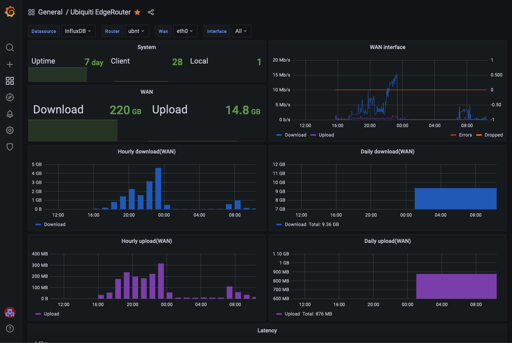
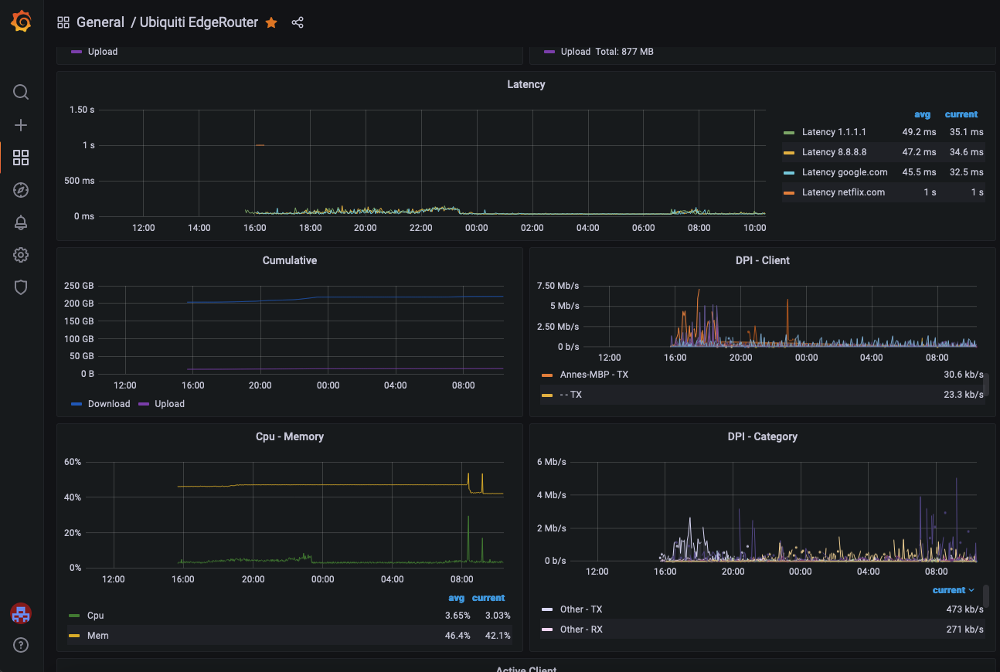
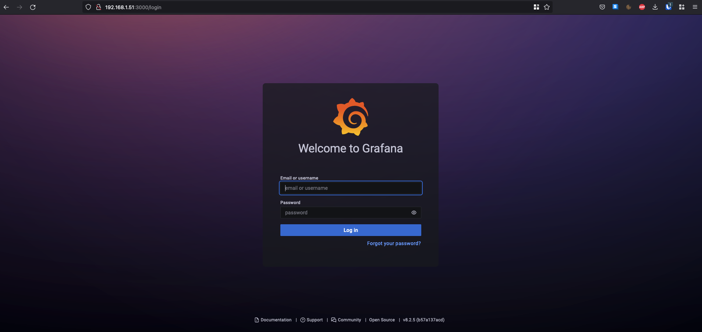
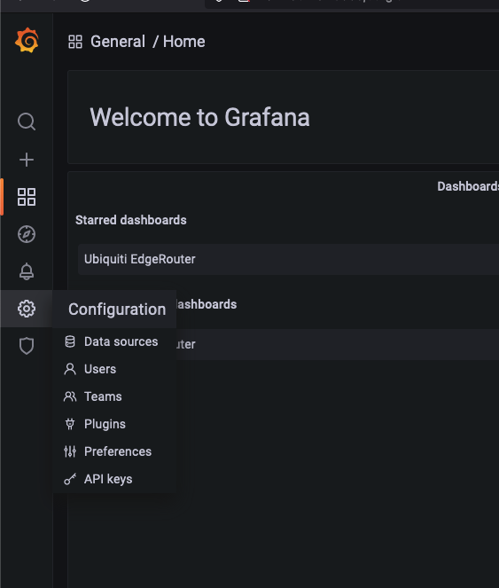
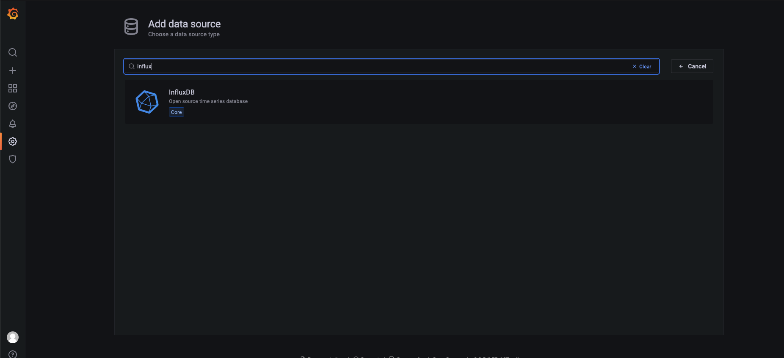
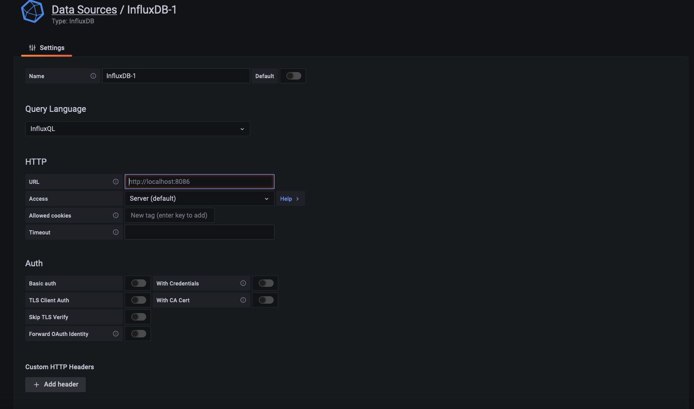
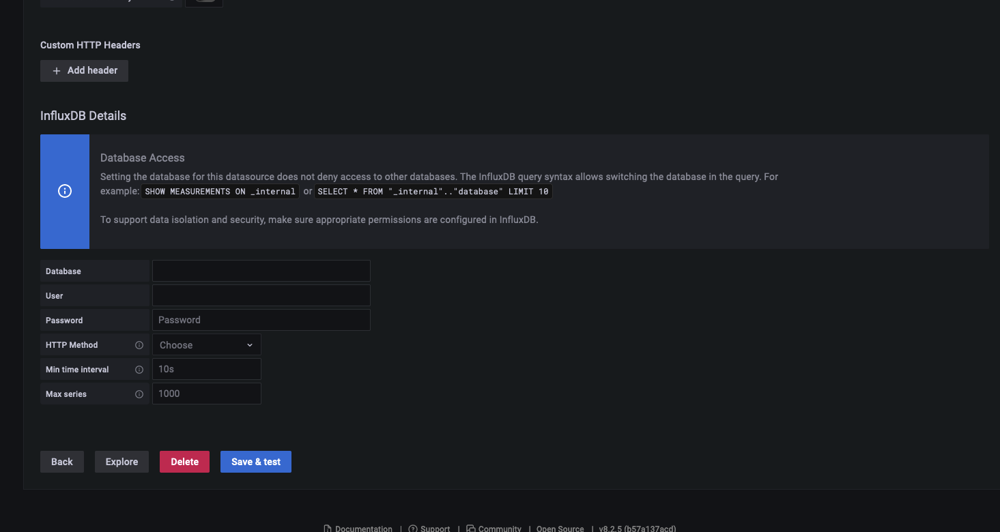
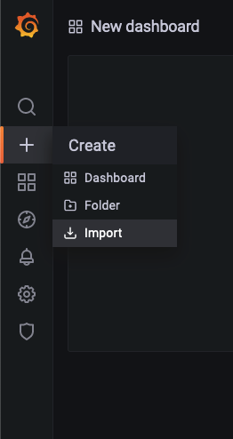
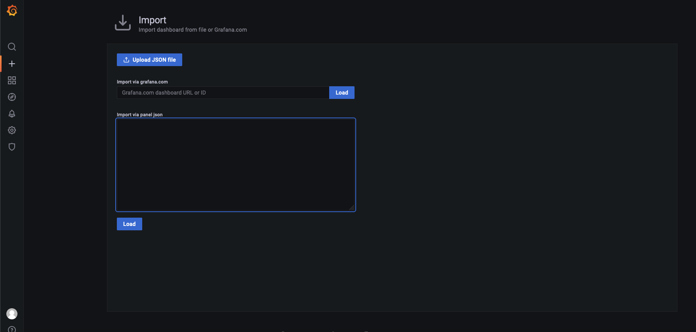

# Data collection software - edge2influx - includes DPI data - Docker image

Afternoon all. I've been working with the beta EdgeMax forum for a week or two hammering out some bugs and I'm ready to announce this to a wider audience. I've been using this trick for a few years now and recently did a complete rewrite and optimization, it's basically plug and play with minimal setup.

## Features

This tool uses the ER's native webUI data endpoints including the  streaming websocket to collect real-time data. Here is just an example  of the data.

- System cpu/mem/uptime
- Interface statistics
- Connected clients ( VPN, webUI, ssh, ... )
- Deep Packet Inspection, anything that you can track in the webUI will be collected and indexed over time for easy perusal.
- Latency statistics from the host(s) of your choice ( uses the built-in ping toolbox ).





## Installation

Update the docker-compose.yml in the example directory.
The docker compose sample installs a compatible influxdb, grafana stack where edge2influx can work with.

At first run the start of edge2influx will fail when you use a self signed certificate(out of box setup). 

### ROUTER_SSL with self signed certificate

run the following command.

```
docker compose up
```

capture the base64 sha256 hash show in the error message and set ROUTER_SSL=base64 sha256

Next run edge2influx will startup.

## Configure grafana to connect with the influx datasource

Open browser and go to 

http://DOCKERHOST:3000/ 

You should see something like this



Login with the env variables set in the docker-compose file(use your own if you changed them...)

```
- GF_SECURITY_ADMIN_USER=admin
- GF_SECURITY_ADMIN_PASSWORD=password
```

Next use the menu to add a data source, this will be our influx db.



Under data sources search for Influx



Use http://DOCKERHOST:8086/ as HTTP value the port 8086 can be changed using INFLUX_PORT.



Leave all Auth options disabled(not recommended for production usage but its fine(uhhh easy ;-p) for home experiments

Scroll down and under Database add edgeos or the value of INFLUXDB_DB



Hit save and test:)

Next step is to create your data dashboard from the provided sample.

Open EdgeRouter-dashboard.json and copy the json.

In grafana navigate to create -> import




Paste the json and press the load button, you should now have a working dashboard.



To see your dashboard go to dashboards:)

## edge2influx Settings/options 

If you want to replace the system hostname with something
else and don't want to change the router config you can
change it here
 - ROUTER_TAGNAME=

##### Credentials to get into the webUI 
- ROUTER_USERNAME=
- ROUTER_PASSWORD=
- ROUTER_URL=

TRUE for SSL that will validate or the base64 sha256
fingerprint for the host, run once and it should error
out and give you the correct fingerprint for this host

- ROUTER_SSL=

##### InfluxDB settings
- INFLUX_HOST=
- INFLUX_DB=edgeos

optional influx settings
- INFLUX_PORT=8086
- INFLUX_USERNAME=
- INFLUX_PASSWORD=


##### Latency settings - optional, by default will
ping 1.1.1.1 every 120 seconds with 3 pings and record the stats.
PING_TARGET can take multiple hosts like 1.1.1.1/8.8.8.8  and will interleve checks

- PING_TARGET=1.1.1.1
- PING_COUNT=3
- PING_SIZE=50
- PING_INTERVAL=120

